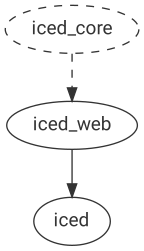

# `iced_web`
[][documentation]
[](https://crates.io/crates/iced_web)
[](https://github.com/hecrj/iced/blob/master/LICENSE)
[](https://iced.zulipchat.com)

`iced_web` takes [`iced_core`] and builds a WebAssembly runtime on top. It achieves this by introducing a `Widget` trait that can be used to produce VDOM nodes.

The crate is currently a __very experimental__, simple abstraction layer over [`dodrio`].



[documentation]: https://docs.rs/iced_web
[`iced_core`]: ../core
[`dodrio`]: https://github.com/fitzgen/dodrio

## Installation
Add `iced_web` as a dependency in your `Cargo.toml`:

```toml
iced_web = "0.2"
```

__Iced moves fast and the `master` branch can contain breaking changes!__ If
you want to learn about a specific release, check out [the release list].

[the release list]: https://github.com/hecrj/iced/releases

## Usage
The current build process is a bit involved, as [`wasm-pack`] does not currently [support building binary crates](https://github.com/rustwasm/wasm-pack/issues/734).

Therefore, we instead build using the `wasm32-unknown-unknown` target and use the [`wasm-bindgen`] CLI to generate appropriate bindings.

For instance, let's say we want to build the [`tour` example]:

```
cd examples
cargo build --package tour --target wasm32-unknown-unknown
wasm-bindgen ../target/wasm32-unknown-unknown/debug/tour.wasm --out-dir tour --web
```

*__Note:__ Keep in mind that Iced is still in early exploration stages and most of the work needs to happen on the native side of the ecosystem. At this stage, it is important to be able to batch work without having to constantly jump back and forth. Because of this, there is currently no requirement for the `master` branch to contain a cross-platform API at all times. If you hit an issue when building an example and want to help, it may be a good way to [start contributing]!*

[start contributing]: ../CONTRIBUTING.md

Once the example is compiled, we need to create an `.html` file to load our application:

```html
<!DOCTYPE html>
<html>
  <head>
    <meta http-equiv="Content-type" content="text/html; charset=utf-8"/>
    <meta name="viewport" content="width=device-width, initial-scale=1">
    <title>Tour - Iced</title>
  </head>
  <body>
    <script type="module">
      import init from "./tour/tour.js";

      init('./tour/tour_bg.wasm');
    </script>
  </body>
</html>
```

Finally, we serve it using an HTTP server and access it with our browser.

[`wasm-pack`]: https://github.com/rustwasm/wasm-pack
[`wasm-bindgen`]: https://github.com/rustwasm/wasm-bindgen
[`tour` example]: ../examples/README.md#tour
